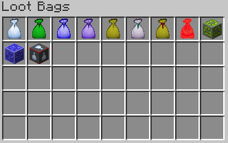
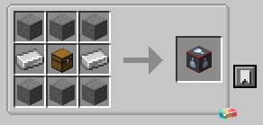
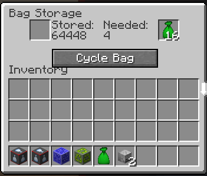
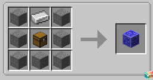
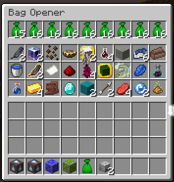
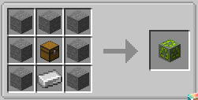
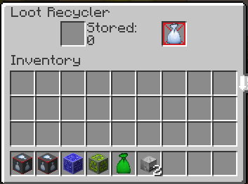

# LootBagsRenewal

Loot Bags is a mod which adds bags that drop other items, renewed by src_resources.

The mod consists of 8 different types of loot bags as well as 3 helper machines which deal with these bags.

Loot bags are dropped whenever you kill mobs, and they are going to drop items. There are 8 loot bag types in total:
common, uncommon, rare, epic, legendary, patient, artificial and bacon. Their value are as follows respectively:

|  **Type**  | **Value** |
|:----------:|-----------|
|   Common   | 1         |
|  Uncommon  | 4         |
|    Rare    | 16        |
|    Epic    | 64        |
| Legendary  | 256       |
|  Patient   | 1024      |
| Artificial | 4096      |
|   Bacon    | 1         |

The value here means how many bag items you need in order to craft bags of the corresponding type. e.g. The Rare Bag's
value is 16, the Uncommon Bag's value is 4, and the Common Bag's value is 1, so you will need 4 common bags to craft an
uncommon bag, 16 common bags to craft a rare bag. And so do other types of bags.

**Specially**, **Artificial Bags** are only able to be obtained in creative mode, which means you can't get this type
of bags through either drops or crafting.

To open a loot bag, simply hold it in your hand (either left hand or right hand) and right-click. The more value the
bag's type has, the more quantity and the better quality of items it will drop.

You can craft the Bag Storage Block to store your loot bags.

Inside its GUI, put your loot bags into the first slot at top-left, and obtain the bag back from the second slot at
top-right later. The value the block has stored is displayed on the GUI screen. You can click the Cycle Bag button to
switch the bag's type you want to obtain from the Bag Storage Block.

To automate the process of opening loot bags, you can use the Bag Opener Block.

Inside its GUI, put the bags you want to open into the top slots, and they will be opened automatically whenever there
are empty output slots.

You can also obtain loot bags by putting items into the Loot Recycler Block.

Inside its GUI, put the items you want to recycle into the first slot at top-left, and obtain the loot bags from the
second slot at top-right.

The input and output of the Bag Storage Block, the Bag Opener Block and the Loot Recycler Block can be automated using
hoppers (by vanilla) and pipes (by other mods). But **note** that the bottom face of these blocks are only for output
purpose, and the other faces are only for input purpose. Trying to put items through the bottom face or get items
through the other faces will result in failure.

The loot items generated from loot bags abide by the Minecraft loot table system, including both vanilla loots and
modded loots. But Bacon Loot Bags are exceptional, as they are only going to drop raw porkchops. But you can put them
inside the Bag Storage Block to turn them into Common Loot Bags to obtain normal loot items.
